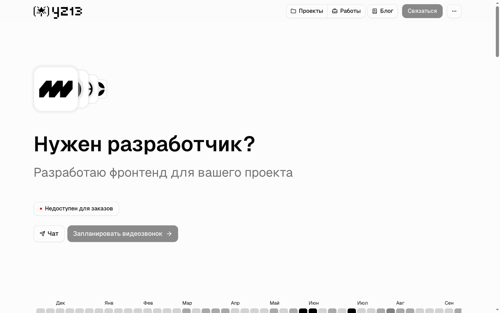

# yz13.ru

Сайт-портфолио

- [Github](https://github.com/yz13-dev)
- [X](https://x.com/yz13_dev)
- [Telegram](https://t.me/yz13_dev)

Внутри приложения `website` есть `Dockerfile`, который отвечает запуск, такой же есть внутри `api` приложения и `docker-compose.yml` для запуска supabase. 

Для `api` нужны следующие .env
```
SUPABASE_SERVICE_ROLE_KEY="..."
SUPABASE_ANON_KEY="..."
POSTGRES_DATABASE="db"
POSTGRES_HOST="db.example.com"
POSTGRES_PASSWORD=""
POSTGRES_PRISMA_URL="postgres://"
POSTGRES_URL="postgres://..."
POSTGRES_URL_NON_POOLING="postgres://..."
POSTGRES_USER="user"
SUPABASE_JWT_SECRET="..."
SUPABASE_URL="https://<url>"
```

Для запуска `supabase` нужно скопировать переменные
из `/apps/supabase/supabase/docker/.env.example` в `/apps/supabase/yz13/.env` и изменить их при необходимости.
